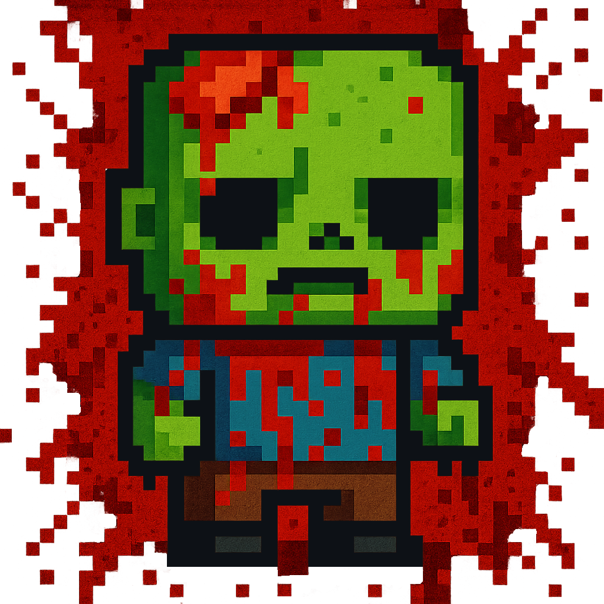

# 🩸🍓 Zombies Survivor



## 💀 What is Zombies Survivor?

**Zombies Survivor** is an adorable yet devastatingly chaotic action-survival roguelike built in **Godot Engine**.  
Think *Vampire Survivors*... if everything were chibi, pink, and covered in *way too much blood*.

You are a homicidal creature — a mix of sweetness and slaughter — fighting off endless hordes of enemies in a bullet hell of glitter, teeth, and chaos.

## 🎮 Features

- 🌸 Procedurally generated waves of enemies — increasingly cute, increasingly dangerous.
- 🍬 Unlockable weapons with overwhelming bloodshed capacity.
- 🧛‍♀️ Auto-attacks and skill tree progression in classic survivor style.
- 🩷 Hyper-stylized pixel graphics and FX — *brutal meets adorable*.
- 💫 Synth-pop, dark-cute soundtrack to vibe-slash to.

## 🛠️ Made With

- 🎮 [Godot Engine](https://godotengine.org/)
- 🐾 Custom assets, animations, and sound effects
- 💖 Pure sadistic love

## 🚧 Roadmap

- [ ] deciding...

## 🔮 Run Locally

1. Clone the repo  
   ```bash
   git clone https://github.com/rabd-games/zombies-survivor.git
   cd zombies-survivor
